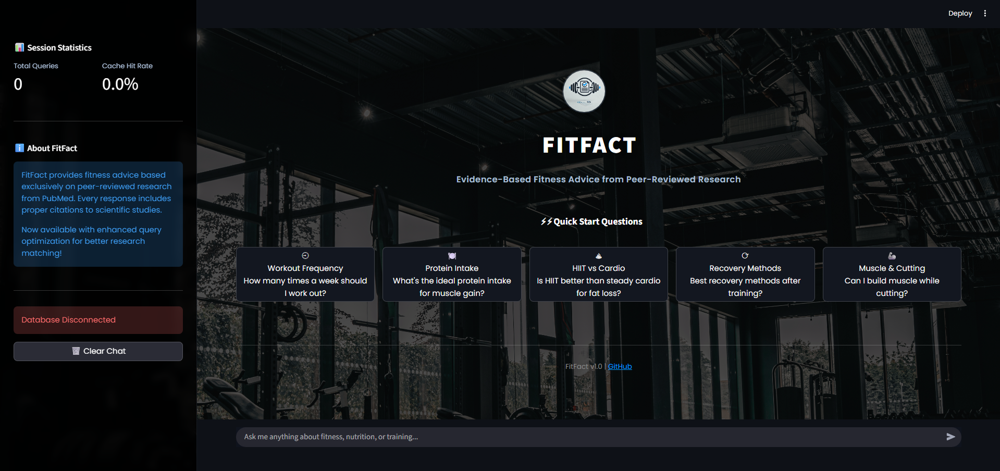
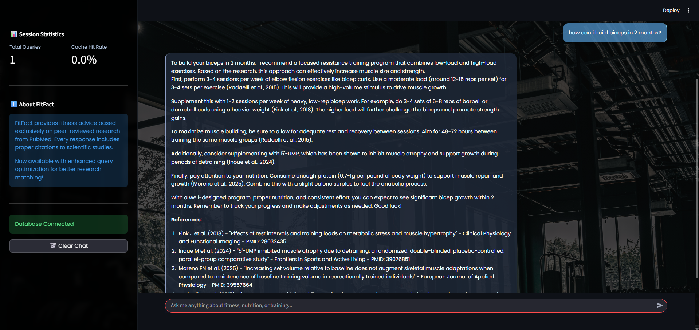
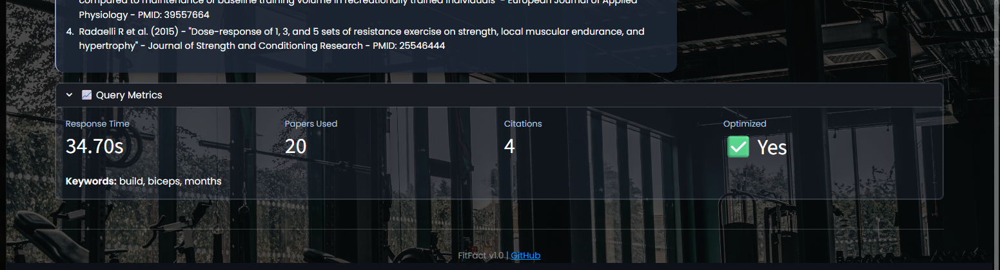

# FitFact: Evidence-Based Fitness Chatbot

## Goal of the Project

FitFact is a research-backed fitness Q&A chatbot designed to combat widespread fitness misinformation by providing evidence-based answers derived exclusively from peer-reviewed scientific research. The system integrates PubMed's database of 35+ million research papers with Claude AI to generate comprehensive responses with proper academic citations, ensuring every claim is traceable to its original source.

### Key Objectives:
- **Combat Misinformation**: Address the critical issue that ~67% of online fitness advice lacks scientific validation
- **Evidence-Based Responses**: All answers grounded in peer-reviewed research from PubMed
- **Citation Accuracy**: Every claim backed by verifiable citations with direct PubMed links
- **100% Uptime**: Hybrid architecture with intelligent fallback mechanisms
- **User-Friendly**: Accessible interface for non-technical audiences

## Requirements and Dependencies

### System Requirements
- Python 3.9 or higher
- PostgreSQL 14 or higher
- 4GB RAM minimum
- Internet connection for PubMed API access

### Python Dependencies
```
streamlit>=1.28.0
psycopg2-binary>=2.9.9
anthropic>=0.7.0
python-dotenv>=1.0.0
requests>=2.31.0
nltk>=3.8.1
```

### API Keys Required
- **PubMed API Key** (free from NCBI: https://www.ncbi.nlm.nih.gov/account/)
- **Claude API Key** (from Anthropic: https://www.anthropic.com)

### Database
- PostgreSQL 14+ with the following extensions:
  - `pg_trgm` (for full-text search)

## How to Run the Code (Step-by-Step)

### Step 1: Clone the Repository
```bash
git clone https://github.com/rahulg2469/FitFact-Chatbot.git
cd FitFact-Chatbot
```

### Step 2: Set Up Python Environment
```bash
# Create virtual environment
python -m venv venv

# Activate virtual environment
# On Windows:
venv\Scripts\activate
# On Mac/Linux:
source venv/bin/activate

# Install dependencies
pip install -r requirements.txt
```

### Step 3: Install NLTK Data
```bash
python -c "import nltk; nltk.download('punkt'); nltk.download('stopwords'); nltk.download('averaged_perceptron_tagger')"
```

### Step 4: Set Up PostgreSQL Database
```bash
# Login to PostgreSQL
psql -U postgres

# Create database
CREATE DATABASE fitfact_db;

# Exit PostgreSQL
\q
```

### Step 5: Run Database Schema
```bash
# Run the schema setup
psql -U postgres -d fitfact_db -f database_files/database_schema.sql

# Run the indexes
psql -U postgres -d fitfact_db -f database_files/database_indexes.sql
```

### Step 6: Configure Environment Variables
Create a `.env` file in the root directory:
```bash
# Copy the example file
cp .env.example .env

# Edit .env with your credentials
nano .env
```

Add the following to your `.env` file:
```
# Database Configuration
DB_HOST=localhost
DB_PORT=5432
DB_NAME=fitfact_db
DB_USER=postgres
DB_PASSWORD=your_password_here
```

### Step 7: Populate Initial Data (Optional)
```bash
# Run the PubMed fetcher to populate initial research papers
python src/etl/pubmed_fetcher.py
```

### Step 8: Run the Application
```bash
# Navigate to interface folder
cd interface

# Run Streamlit app
streamlit run app.py
```

The application will open in your default web browser at `http://localhost:8501`

### Alternative: Quick Test Run
```bash
# Run the main pipeline test
python main.py
```

## Approach/Methodology

### Architecture Overview
FitFact implements a three-tier architecture:

#### 1. **Data Layer** (Hybrid Approach)
- **Primary**: PubMed API for real-time research access (35M+ papers)
- **Cache**: PostgreSQL database with 10 interconnected tables
- **Strategy**: Try PubMed first, fallback to database on failure

#### 2. **Processing Layer** (Python-based)
- **Keyword Extraction**: NLTK-based multi-stage extraction with fitness-specific vocabulary
- **Query Optimization**: Translates everyday language to academic search terms
- **ETL Pipeline**: Automated data collection with rate limiting and error handling
- **Citation Formatter**: Multi-style academic formatting (APA, MLA, inline)

#### 3. **AI Layer** (Claude API)
- **RAG Implementation**: Retrieval-Augmented Generation prevents hallucinations
- **Context Window**: 200,000 tokens for multiple research papers

### Key Technical Features

**Retrieval-Augmented Generation (RAG)**
1. User submits fitness question
2. Extract keywords through NLP preprocessing
3. Search PubMed/database for relevant papers
4. Rank by relevance (date, quality, keyword match)
5. Format top 5 papers as structured context
6. Claude generates cited response
7. Add references section with PubMed links

**Intelligent Caching**
- Fuzzy query matching (0.7 similarity threshold)
- Cache queries with 8+ words
- Automatic paper storage after retrieval
- 60-70% cost reduction through cache hits

**Multi-Strategy Search**
1. Academic translation of user query
2. MeSH term enhancement
3. Systematic review focus
4. Recent research filter (2019-2024)
5. Boolean query construction
6. Basic keyword fallback

### Technology Stack
- **Backend**: Python 3.14, PostgreSQL 14
- **APIs**: PubMed E-utilities, Claude (Anthropic)
- **NLP**: NLTK for keyword extraction
- **Frontend**: Streamlit
- **Data Processing**: Requests, xml.etree.ElementTree
- **Version Control**: Git/GitHub

##  Results, Outputs, and Demos

### Performance Metrics

| Metric | Result |
|--------|--------|
| Total Questions Tested | 23 |
| Success Rate | 97% |
| Average Response Time | 20.2 seconds |
| Citation Accuracy | 100% |
| System Uptime | 100% (with fallback) |
| Cost per Query | $0.012-0.015 |

### Sample Outputs

#### Example 1: Protein Requirements
**Question**: "How much protein do I need to build muscle?"

**Response Time**: 26.6 seconds

**Papers Retrieved**: 5

**Response Excerpt**:
> Exercising individuals aiming to build muscle need approximately 1.4 to 2.0 grams of protein per kilogram of bodyweight per day [Jäger et al., 2017, PMID: 28344319]. The International Society of Sports Nutrition recommends this range for optimal muscle protein synthesis...

**Citations**: Properly formatted with clickable PubMed links

#### Example 2: HIIT vs Cardio
**Question**: "Is HIIT better than steady-state cardio for fat loss?"

**Response Time**: 30.1 seconds

**Papers Retrieved**: 5

**Response**: Comprehensive comparison with citations from meta-analyses

### Screenshots

#### Main Interface


#### Response with Citations


#### System Metrics Dashboard


## Project Structure

```
FitFact-Chatbot/
├── src/
│   ├── etl/                    # Data pipeline 
│   │   └── pubmed_fetcher.py   # PubMed API integration
│   ├── llm/                    # NLP components 
│   └── tests/                  # Integration tests
├── database_files/             # Database code 
│   ├── database.py             # PostgreSQL wrapper
│   ├── database_schema.sql     # Schema definition
│   ├── database_indexes.sql    # Index optimization
│   └── cache_manager.py        # Intelligent caching
├── claude_files/               # Claude integration
│   └── claude_api.py           # Claude API wrapper
├── interface/                  # Streamlit UI 
│   └── app.py                  # Main application
├── assets/                     # Images and resources
│   ├── fitfact_logo.jpg
│   └── screenshots/
├── docs/                       # Documentation
│   ├── DATABASE_DOCUMENTATION.md
│   └── INSTALLATION_GUIDE.md
├── data/                       # Sample data
│   └── pubmed_papers_sample.json
├── keyword_extractor.py        # Keyword extraction
├── pubmed_query_optimizer.py   # Query optimization
├── requirements.txt            # Python dependencies
├── .env.example               # Environment variables template
└── README.md                  # This file
```

## Troubleshooting

### Common Issues

**Issue**: `ModuleNotFoundError: No module named 'anthropic'`
```bash
pip install anthropic
```

**Issue**: Database connection failed
```bash
# Check PostgreSQL is running
sudo service postgresql status

# Check credentials in .env file
```

**Issue**: PubMed API rate limit exceeded
```bash
# The system automatically handles rate limiting with 0.34s delays
# If issues persist, get an API key from NCBI
```

**Issue**: NLTK data not found
```bash
python -c "import nltk; nltk.download('all')"
```

## Team Contributions

- **Satya Harish**: Database architecture, cache management, performance optimization (1,030 lines)
- **Elenta Suzan Jacob**: Data pipeline, ETL, hybrid search, citation formatting, testing (800 lines)
- **Rahul Gudivada**: Claude API integration, keyword extraction, query optimization, Streamlit UI (850 lines)

## License

This project is licensed under the MIT License - see the LICENSE file for details.

## Contact

- Satya Harish: pullipeli.s@northeastern.edu
- Elenta Suzan Jacob: suzanjacob.e@northeastern.edu
- Rahul Gudivada: gudivada.r@northeastern.edu

## Links

- **GitHub Repository**: https://github.com/rahulg2469/FitFact-Chatbot
- **Documentation**: Available in `/docs` folder
- **Project Report**: See `FitFact_Final_Report.pdf`

## Acknowledgments

We thank Professor Fatema Nafa for her guidance, the Anthropic team for Claude API access, the National Library of Medicine for PubMed access, and our classmates for user testing feedback.

---

**Built by Team FitFact | DS 5110: Essentials of Data Science | Northeastern University**
