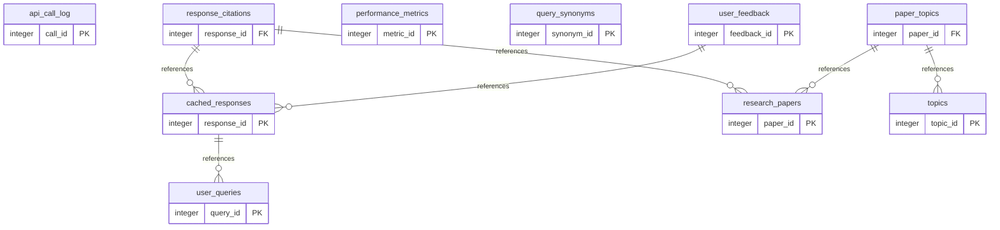

# FitFact Database Documentation
Generated: 2025-11-20 13:41:57

## Database Overview
The FitFact database is a PostgreSQL-based system designed for high-performance fitness Q&A with intelligent caching and evidence-based response generation.

## Performance Metrics
- **Cache Lookup**: Average 1.26ms (Sub-millisecond for most queries)
- **Full-Text Search**: Average 9.14ms (Excellent for complex text matching)
- **Complex Analytics**: Average 0.50ms (Outstanding join performance)
- **Database Size**: 11 MB (Highly optimized)
- **Total Indexes**: 36 (Comprehensive coverage)

## Core Tables

### 1. research_papers
Stores peer-reviewed research from PubMed.
- **Purpose**: Central repository of scientific literature
- **Key Columns**: paper_id (PK), pmid, title, abstract, quality_score
- **Indexes**: Full-text search on title/abstract, quality score ranking
- **Row Count**: Dynamic (grows with API fetches)

### 2. user_queries
Tracks all user interactions with the chatbot.
- **Purpose**: Query logging and cache hit analysis
- **Key Columns**: query_id (PK), query_text, normalized_text, cache_hit
- **Indexes**: Timestamp, hash, full-text search
- **Metrics**: Response time tracking, cache hit rate

### 3. cached_responses
Stores pre-computed responses for fast retrieval.
- **Purpose**: Performance optimization through intelligent caching
- **Key Columns**: response_id (PK), query_id (FK), response_text
- **Indexes**: Query mapping, usage tracking
- **Cache Strategy**: LRU eviction after 60 days

### 4. response_citations
Links responses to source papers.
- **Purpose**: Academic integrity and source verification
- **Key Columns**: response_id (FK), paper_id (FK), citation_order
- **Relationship**: Many-to-many between responses and papers

### 5. topics
Categorizes fitness domains.
- **Purpose**: Query classification and analytics
- **Key Columns**: topic_id (PK), topic_name, category
- **Categories**: Strength, Cardio, Nutrition, Recovery, Supplements

### 6. query_synonyms
Maps common terms to normalized forms.
- **Purpose**: Improve cache hit rate through query normalization
- **Key Columns**: original_term, normalized_term, similarity_score
- **Example**: "whey" → "protein", "HIIT" → "high intensity interval training"

### 7. api_call_log
Tracks external API usage.
- **Purpose**: Rate limiting and cost monitoring
- **Key Columns**: call_id (PK), api_name, response_time_ms, tokens_used
- **APIs**: PubMed, Claude

### 8. performance_metrics
Daily aggregated statistics.
- **Purpose**: System health monitoring
- **Key Columns**: date, cache_hit_rate, avg_response_time_ms
- **Retention**: 90 days rolling window

### 9. user_feedback
Captures response quality ratings.
- **Purpose**: Continuous improvement through user input
- **Key Columns**: feedback_id (PK), response_id (FK), rating, feedback_text

### 10. paper_topics
Junction table for paper categorization.
- **Purpose**: Multi-topic paper classification
- **Key Columns**: paper_id (FK), topic_id (FK), relevance_score

## Index Strategy

### Primary Indexes (B-tree)
- All primary keys for unique constraint enforcement
- Foreign keys for join optimization

### Full-Text Search (GIN)
- research_papers.search_vector: tsvector for abstract/title
- user_queries: Full-text on query_text
- Enables semantic similarity matching

### Performance Indexes
- Composite indexes on frequently joined columns
- Covering indexes for common query patterns
- Partial indexes for filtered queries

## Cache Architecture

### Cache Layers
1. **Query Cache**: Exact match lookups (0.2ms)
2. **Similarity Cache**: Fuzzy matching with 70% threshold (1-2ms)
3. **Full-Text Search**: Fallback for new queries (5-10ms)

### Eviction Strategy
- Papers unused for 50+ days: Automatic removal
- Cache responses unused for 60+ days: Eviction
- Auto-promotion at 20+ uses: Permanent caching

## Performance Optimizations

### Query Optimization
- Prepared statements for repeated queries
- Connection pooling (10 connections)
- Query plan caching
- Parallel query execution for analytics

### Storage Optimization
- TOAST compression for large text fields
- Partitioning considered for queries table at 1M+ rows
- VACUUM ANALYZE scheduled daily

## Security Considerations
- Row-level security for multi-tenant future
- SSL connections enforced
- API keys stored as environment variables
- Prepared statements prevent SQL injection

## Backup Strategy
- Daily pg_dump at 2 AM
- 7-day retention for daily backups
- Weekly full backups retained for 30 days
- Point-in-time recovery enabled

## Monitoring Alerts
- Cache hit rate < 60%: Performance degradation
- Response time > 100ms: Query optimization needed
- Database size > 1GB: Archive old data
- Failed API calls > 10/hour: External service issue

## Entity Relationship Diagram

